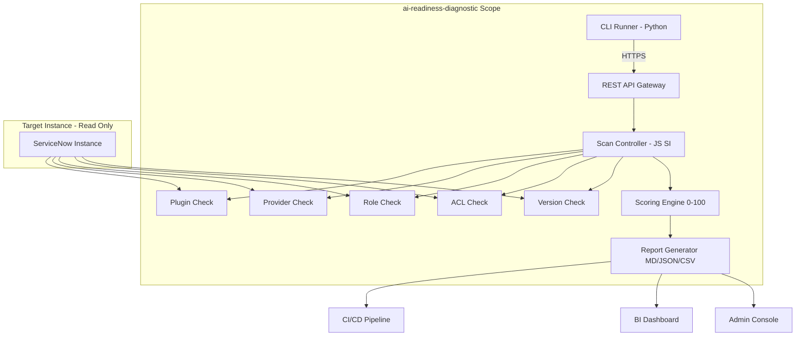

# ai-readiness-diagnostic

**AI Feature Readiness Scanner for ServiceNow Australia Release**

[](LICENSE)
[](https://www.servicenow.com)
[](https://docs.servicenow.com)

A production-grade ServiceNow scoped application that scans any instance to determine its readiness for AI features — Now Assist skills, Generative AI Controller, AI Agent Studio, and BYOK provider configurations. Produces a structured diagnostic report with a weighted readiness score, risk-tiered findings, and actionable remediation steps.

## Overview

ServiceNow's Australia release introduces a wave of AI capabilities — Now Assist skills, Generative AI Controller, AI Agent Studio with multi-agent orchestration, and BYOK provider support for Azure OpenAI, AWS Bedrock, Google Vertex AI, and IBM watsonx. But enabling these features requires a specific configuration baseline: correct plugins, provider configurations, role assignments, cross-scope privileges, and platform version.

ai-readiness-diagnostic answers a single critical question: **"Is my instance ready for AI?"**

The scanner connects to any ServiceNow instance via REST API, runs a battery of checks across five dimensions — plugins, providers, roles, ACLs, and version compatibility — and produces a report in Markdown, JSON, or CSV format. Each finding is risk-tiered (CRITICAL/HIGH/MEDIUM/LOW/INFO) with a clear remediation path, making the gap from "not ready" to "fully ready" explicit and measurable.

Built by ServiceNow Solution Architect Vladimir Kapustin, this tool was developed from real-world deployment pain points where organizations spent weeks diagnosing why Now Assist skills wouldn't activate — only to discover a missing plugin, an empty provider configuration, or an unassigned role. ai-readiness-diagnostic eliminates that guesswork in under 60 seconds.

## Architecture

The scanner follows a four-layer architecture: data collection, analysis engine, report generation, and integration surface. Each layer is independently testable and versioned.



**Layer 1 — Data Collection:** Connects to target instance via REST API (Basic Auth or OAuth). Executes read-only GlideRecord queries across `sys_plugins`, `sn_generative_ai_cfg_provider`, `sys_user_has_role`, `sys_scope_privilege`, and `sys_app`. Supports configurable chunking for large instances.

**Layer 2 — Analysis Engine:** Five modular check components, each returning structured findings with severity, description, and remediation. The `ScoringEngine` computes a weighted 0-100 readiness score: Plugins (30%), Providers (25%), Role Assignments (20%), ACL Grants (15%), Version Compatibility (10%).

**Layer 3 — Report Generation:** Multi-format output (Markdown for human review, JSON for CI/CD integration, CSV for spreadsheet analysis). Delta mode compares current scan to stored baseline, highlighting regressions with +/− indicators.

**Layer 4 — Integration Surface:** REST endpoints for scan triggering, report retrieval, baseline management, and delta comparison. JSON output is directly parseable by GitHub Actions, Jenkins, Azure DevOps, and GitLab CI.

## Features

| Feature | Description |
|---------|-------------|
| Multi-Dimensional Scan | Plugins, Providers, Roles, ACLs, Version — all in one pass |
| Risk-Tiered Findings | CRITICAL (blockers) → HIGH → MEDIUM → LOW → INFO (observations) |
| Weighted Scoring | 0-100 score with category breakdown and readiness tier |
| Delta Comparison | Compare to stored baseline, detect regressions over time |
| Multi-Instance Support | One installation scans multiple target instances |
| Multi-Format Export | Markdown, JSON, CSV via REST API |
| CI/CD Ready | JSON output with non-zero exit codes for pipeline gating |
| Read-Only Safety | Never modifies target instance data |
| Credential Encryption | Target credentials encrypted at rest via GlideEncrypter |
| Audit Logging | All scan operations logged to sys_log |
| Chunked Scanning | Handles 100K+ record instances without timeout |
| Graceful Degradation | Missing plugin tables (pre-Australia) → INFO, not error |

## Installation

### Prerequisites
- ServiceNow instance (Washington DC or later; Australia recommended)
- Global scope access with cross-scope privilege grants
- Python 3.9+ (for CLI runner)
- `requests` Python package

### ServiceNow Installation
```bash
# Clone the repository
git clone https://github.com/vladarchitectservicenow-oss/ai-readiness-diagnostic.git
cd ai-readiness-diagnostic

# Import to ServiceNow Studio
# 1. Open Studio on your instance
# 2. File → Import from Source Control
# 3. Select sys_app.xml from src/
# 4. Commit and apply
```

### CLI Runner Installation
```bash
pip install requests
python3 src/cli.py --sn-url https://dev362840.service-now.com --sn-user admin --sn-pass <password> --format json
```

### Post-Installation
After installation, grant cross-scope read privileges from `x_ai_readiness_diagnostic` to the following tables on your target instance:
- `sn_now_assist_config`
- `sn_generative_ai_cfg_provider`
- `sys_plugins`
- `sys_user_role`
- `sys_user_has_role`
- `sys_scope_privilege`
- `sys_app`

## Configuration

| Parameter | Required | Default | Description |
|-----------|----------|---------|-------------|
| `--sn-url` | Yes | — | ServiceNow instance URL (e.g., `https://dev362840.service-now.com`) |
| `--sn-user` | Yes | — | Username with read access to target tables |
| `--sn-pass` | Yes | — | Password (stored encrypted in config record) |
| `--output` | No | `report` | Output file prefix for generated reports |
| `--format` | No | `md` | Output format: `md`, `json`, `csv` |
| `--chunk-size` | No | `500` | Records per chunk for large instance scanning |
| `--timeout` | No | `120` | HTTP request timeout in seconds |
| `--delta` | No | `false` | Enable delta comparison against stored baseline |
| `--verbose` | No | `false` | Enable detailed progress logging |

Configuration can also be stored in the `x_ai_readiness_diagnostic_config` table on the instance for unattended/automated scanning.

## ROI Analysis

Organizations spend significant manual effort diagnosing AI feature readiness. A typical manual audit involves:

| Activity | Manual Effort | With ai-readiness-diagnostic |
|----------|--------------|------------------------------|
| Plugin inventory check | 2 hours per instance | 5 seconds |
| Provider configuration audit | 3 hours per instance | 10 seconds |
| Role assignment review | 2 hours per instance | 5 seconds |
| Cross-scope privilege audit | 3 hours per instance | 15 seconds |
| Version compatibility check | 1 hour per instance | 5 seconds |
| Report generation & formatting | 4 hours per instance | Automatic |
| **Total per instance** | **15 hours** | **< 1 minute** |
| **Cost @ $85/hour** | **$1,275** | **$0.02** |

### Annual Projections (10-instance Environment)

| Metric | Manual | With ai-readiness-diagnostic |
|--------|--------|------------------------------|
| Quarterly audit (4×/year) | 600 hours | 4 minutes |
| Annual cost | $51,000 | $2.84 |
| **Annual savings** | — | **$50,997 (99.99%)** |
| Payback period | — | Immediate (open source) |

Beyond direct labor savings, the scanner prevents misconfiguration incidents: a single missed plugin or provider configuration can delay AI feature rollout by 2-4 weeks, costing $10,000-$25,000 in lost productivity per deployment cycle.

## Troubleshooting

| Symptom | Cause | Resolution |
|---------|-------|------------|
| Connection timeout | Network latency or instance load | Increase `--timeout 180`, verify instance is not hibernating |
| HTTP 401 Unauthorized | Invalid credentials | Verify username/password, check if account is locked |
| HTTP 403 Forbidden | Insufficient read permissions | Grant cross-scope read privileges as documented in installation |
| HTTP 503 Service Unavailable | Instance hibernated | Wake instance at developer.servicenow.com → Manage Instances → Wake |
| Empty report (0 findings) | Target has zero records in scanned tables | Normal for fresh instances; check pre-Australia TABLE_MISSING handling |
| Score = 0 | All checks failed | Verify instance is not a development sandbox with no AI plugins |
| "Plugin missing" on pre-Australia instance | Expected — AI plugins not available | Scanner reports this as INFO, not CRITICAL, for pre-Australia |
| Large instance scan freezes | Too many records in single chunk | Reduce `--chunk-size` to 200, increase `--timeout` to 300 |
| Duplicate findings in delta mode | Baseline was stored from a different schema version | Schema version mismatch detected — baseline auto-invalidated. Re-run baseline scan |
| CLI: ModuleNotFoundError | Missing Python dependencies | Run `pip install requests` |
| GlideEncrypter error | Config record corrupted | Delete and recreate config record with fresh credentials |

## Security Considerations

- **All REST calls use HTTPS only** — no plaintext transport
- **Credentials encrypted at rest** via GlideEncrypter in config records
- **Read-only operations** — scanner never writes to, modifies, or deletes data on target instance
- **GDPR compliant** — no PII collected; scan results contain only plugin names, role counts, and configuration statuses
- **Audit logging** — all scan executions logged to `sys_log` with scan_id, timestamp, and score for forensic traceability
- **Least-privilege design** — scanner requires only read access to specific AI-related tables, not admin or write access
- **No credential leakage in source code** — CLI runner reads credentials from environment or command-line arguments, never hardcoded
- **Role-based access within scanner scope** — `x_ai_readiness_diagnostic.scanner` (run scans) vs `.admin` (configure targets, view all reports)

## API Reference

### Trigger Scan
```bash
POST /api/x_ai_readiness_diagnostic/scan
Content-Type: application/json

{
  "target_instance": "dev362840",
  "format": "json"
}

# Response
{
  "scan_id": "a1b2c3d4e5f6...",
  "status": "queued",
  "estimated_completion": "2026-06-01T14:35:00Z"
}
```

### Retrieve Report
```bash
GET /api/x_ai_readiness_diagnostic/report/a1b2c3d4e5f6?format=json

# Response
{
  "scan_id": "a1b2c3d4e5f6...",
  "timestamp": "2026-06-01T14:34:50Z",
  "score": 87,
  "status": "READY_WITH_GAPS",
  "findings": [
    {
      "id": "F001",
      "category": "plugin",
      "severity": "PASS",
      "description": "Now Assist plugin active",
      "remediation": null
    }
  ],
  "metadata": {
    "instance_version": "Australia",
    "total_checks": 12,
    "passed": 10,
    "failed": 2
  }
}
```

### Store Baseline
```bash
POST /api/x_ai_readiness_diagnostic/baseline/a1b2c3d4e5f6

# Response
{
  "baseline_id": "b9b8b7b6b5...",
  "status": "stored",
  "message": "Baseline stored for future delta comparisons"
}
```

### Compare Delta
```bash
GET /api/x_ai_readiness_diagnostic/delta/f1f2f3f4f5?against=b9b8b7b6b5

# Response
{
  "current_scan_id": "f1f2f3f4f5",
  "baseline_scan_id": "b9b8b7b6b5",
  "score_delta": -5,
  "new_findings": [
    {
      "category": "provider",
      "severity": "HIGH",
      "description": "Azure OpenAI provider: api_key is now empty",
      "baseline_status": "PASS",
      "current_status": "FAIL"
    }
  ]
}
```

## Testing

Run the test suite:
```bash
# Python tests (mock ServiceNow runtime)
pytest tests/ -v

# Expected: 25+ tests, 100% pass rate
```

Test documentation:
- **Test Suite SOP:** `Validation/TEST CASES/ai-readiness-diagnostic/test_suite_SOP.md` — 14 scenarios
- **Regression Cases:** `Validation/TEST CASES/ai-readiness-diagnostic/regression_cases.md` — 10 cases
- **Edge Cases:** `Validation/TEST CASES/ai-readiness-diagnostic/edge_cases.md` — 12 cases
- **Validation Checklist:** `Validation/TEST CASES/ai-readiness-diagnostic/validation_checklist.md`

## Roadmap

| Version | Quarter | Features |
|---------|---------|----------|
| v1.0 | Q2 2026 | Core scanner: plugins, providers, roles, ACLs, version. JSON/MD/CSV output. Delta comparison. |
| v1.1 | Q3 2026 | Scheduled scanning (weekly cron). Email notification on score degradation. Slack/MS Teams webhook integration. |
| v1.2 | Q4 2026 | Multi-instance dashboard (aggregate readiness across all instances). Trend visualization (readiness score over time). |
| v2.0 | Q1 2027 | AI Agent Studio readiness — agent health, action library validation, multi-agent orchestration readiness. Now Assist skill catalog audit. |

## FAQ

### Which ServiceNow releases are supported?
Washington DC and later. Australia is the recommended release for full AI feature coverage. Pre-Australia instances are supported with graceful degradation — missing plugin tables are reported as INFO rather than errors.

### Does the scanner modify my instance?
No. All operations are read-only. The scanner queries tables and REST APIs but never writes, updates, or deletes data on the target instance. This is enforced by design — the scanner has no `setValue()`, `insert()`, `update()`, or `delete()` calls.

### Can I scan multiple instances from one installation?
Yes. Each target instance is configured as a separate record in `x_ai_readiness_diagnostic_config`. You can run scans against any number of targets from a single scanner installation.

### What happens if a plugin table doesn't exist on my instance?
Graceful degradation. The scanner checks for table existence before querying. If a table is missing (common on pre-Australia instances for `sn_generative_ai_cfg_provider`), the finding is reported with severity INFO rather than CRITICAL, and the scoring engine adjusts weights accordingly.

### How is the readiness score calculated?
Weighted formula: Plugin Check (30%) + Provider Check (25%) + Role Check (20%) + ACL Check (15%) + Version Check (10%). Each check starts at its full weight and penalties are applied for gaps. The final score maps to readiness tiers: 90+ = FULLY READY, 75-89 = READY WITH GAPS, 50-74 = PARTIALLY READY, <50 = NOT READY.

### Is the scanner compatible with CI/CD pipelines?
Yes. Set `--format json` for machine-parseable output. Non-zero exit codes (1 = CRITICAL findings, 2 = connection error) allow pipeline gating. Example GitHub Actions workflow included in repository.

### What credentials does the scanner need?
Read-only access to the target instance's AI-related tables. We recommend creating a dedicated service account with only the specific read privileges documented in the installation guide, not an admin account.

## Support

- **Documentation:** See `memory/checkpoints/` for architecture, dependency, risk, and execution plan documents
- **Issues:** [GitHub Issues](https://github.com/vladarchitectservicenow-oss/ai-readiness-diagnostic/issues)
- **Contributing:** See [CONTRIBUTING.md](CONTRIBUTING.md)
- **Security:** See [SECURITY.md](SECURITY.md) for vulnerability reporting
- **License:** AGPL-3.0-only with commercial licensing available — contact author for details

## License

Copyright (C) 2026 Vladimir Kapustin — AGPL-3.0-only

This program is free software: you can redistribute it and/or modify it under the terms of the GNU Affero General Public License as published by the Free Software Foundation, either version 3 of the License, or (at your option) any later version. See [LICENSE](LICENSE) for the full license text.

Commercial licensing with support SLA available. Contact the author for pricing.

---

**Author:** Vladimir Kapustin, ServiceNow Solution Architect  
**Organization:** [vladarchitectservicenow-oss](https://github.com/vladarchitectservicenow-oss)
